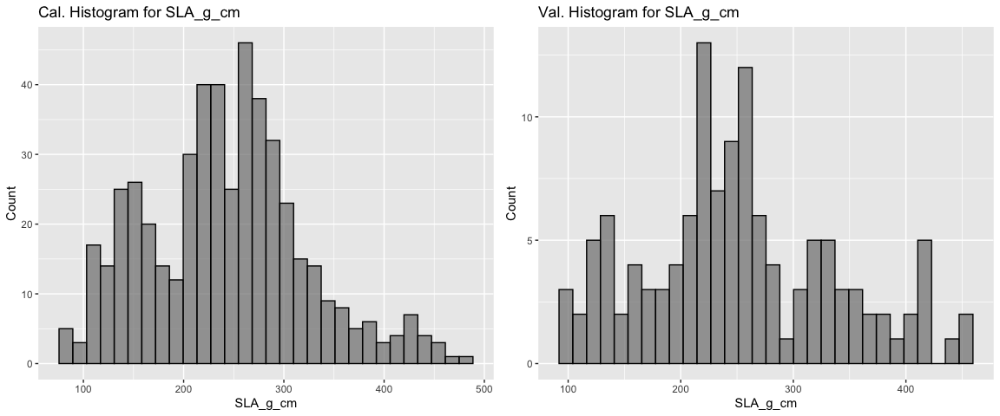
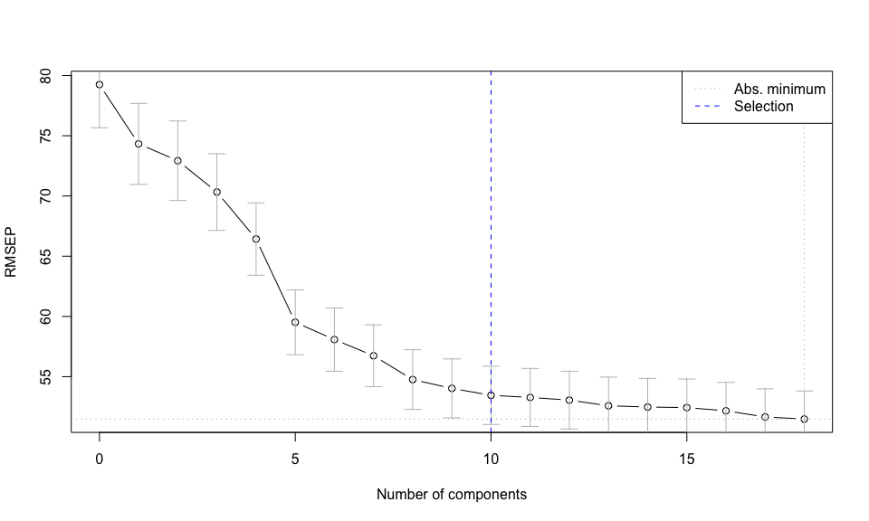
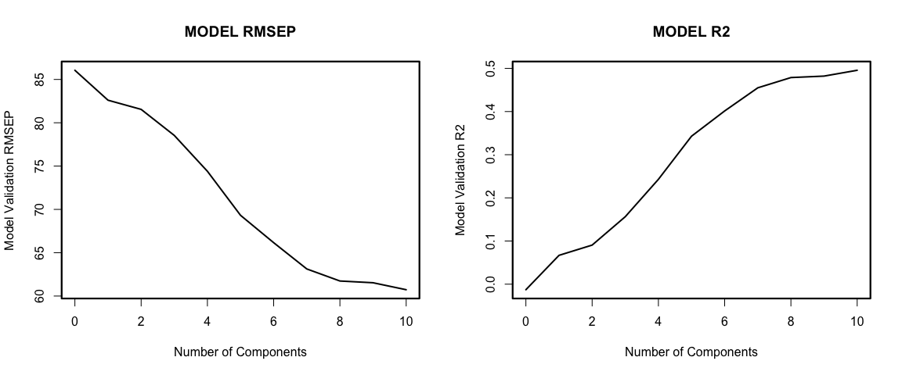
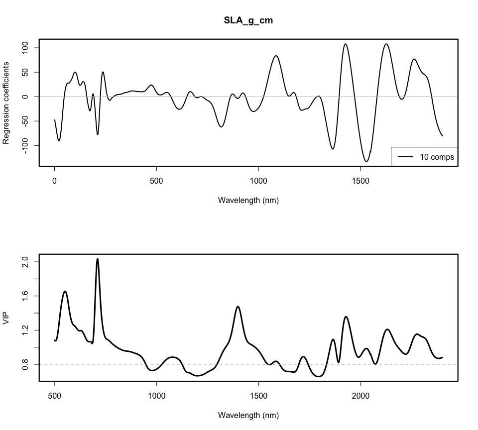
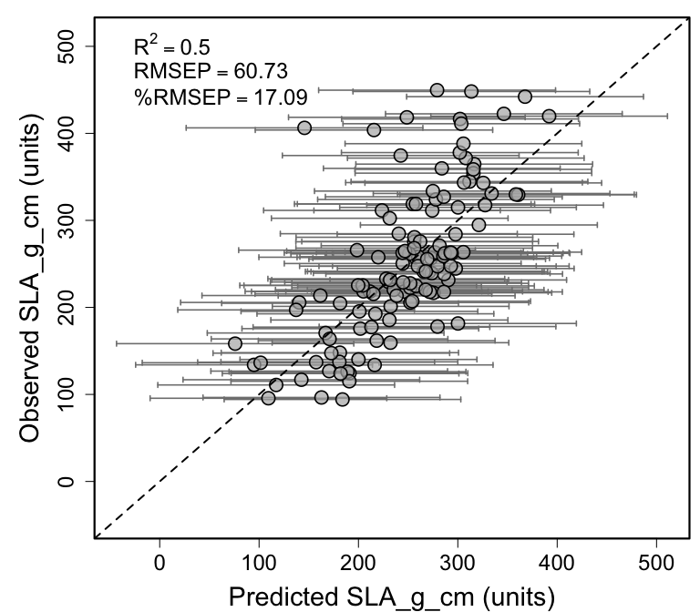

Spectra-trait PLSR example using leaf-level spectra and specific leaf
area (SLA) data from more than 40 species grassland species comprising
both herbs and graminoids.
================
Shawn P. Serbin, Julien Lamour, & Jeremiah Anderson

### Overview

This is an [R Markdown](http://rmarkdown.rstudio.com) Notebook to
illustrate how to retrieve a dataset from the EcoSIS spectral database,
choose the “optimal” number of plsr components, and fit a plsr model for
specific leaf area (SLA). In this example, the plants were cultivated in
an outdoor setting in the botanical garden of the KIT using 40x40 cm
pots with an standardized substrate. The data was measured on a weekly
basis (the timestamp is included in the dataset).

### Getting Started

### Load libraries

``` r
list.of.packages <- c("pls","dplyr","reshape2","here","plotrix","ggplot2","gridExtra",
                      "spectratrait")
invisible(lapply(list.of.packages, library, character.only = TRUE))
```

    ## 
    ## Attaching package: 'pls'

    ## The following object is masked from 'package:stats':
    ## 
    ##     loadings

    ## 
    ## Attaching package: 'dplyr'

    ## The following objects are masked from 'package:stats':
    ## 
    ##     filter, lag

    ## The following objects are masked from 'package:base':
    ## 
    ##     intersect, setdiff, setequal, union

    ## here() starts at /Users/sserbin/Data/GitHub/spectratrait

    ## 
    ## Attaching package: 'gridExtra'

    ## The following object is masked from 'package:dplyr':
    ## 
    ##     combine

### Setup other functions and options

``` r
### Setup other functions and options
# not in
`%notin%` <- Negate(`%in%`)

# Script options
pls::pls.options(plsralg = "oscorespls")
pls::pls.options("plsralg")
```

    ## $plsralg
    ## [1] "oscorespls"

``` r
# Default par options
opar <- par(no.readonly = T)

# What is the target variable?
inVar <- "SLA_g_cm"

# What is the source dataset from EcoSIS?
ecosis_id <- "3cf6b27e-d80e-4bc7-b214-c95506e46daa"

# Specify output directory, output_dir 
# Options: 
# tempdir - use a OS-specified temporary directory 
# user defined PATH - e.g. "~/scratch/PLSR"
output_dir <- "tempdir"
```

### Set working directory (scratch space)

    ## [1] "Output directory: /private/var/folders/xp/h3k9vf3n2jx181ts786_yjrn9c2gjq/T/RtmpktUPJx"

### Grab data from EcoSIS

``` r
print(paste0("Output directory: ",getwd()))  # check wd
```

    ## [1] "Output directory: /Users/sserbin/Data/GitHub/spectratrait/vignettes"

``` r
### Get source dataset from EcoSIS
dat_raw <- spectratrait::get_ecosis_data(ecosis_id = ecosis_id)
```

    ## [1] "**** Downloading Ecosis data ****"

    ## Downloading data...

    ## 
    ## ── Column specification ────────────────────────────────────────────────────────
    ## cols(
    ##   .default = col_double(),
    ##   `growth form` = col_character(),
    ##   species = col_character(),
    ##   timestamp = col_character()
    ## )
    ## ℹ Use `spec()` for the full column specifications.

    ## Download complete!

``` r
head(dat_raw)
```

    ## # A tibble: 6 x 2,114
    ##   `Anthocyanin concen… `Anthocyanin cont… `Carotenoid concen… `Carotenoid conte…
    ##                  <dbl>              <dbl>               <dbl>              <dbl>
    ## 1              0.00106              0.997             0.00799               7.49
    ## 2              0.00357              1.22              0.0221                7.53
    ## 3              0.00252              1.14              0.0188                8.55
    ## 4              0.00310              2.26              0.0158               11.5 
    ## 5              0.00412              1.73              0.0216                9.08
    ## 6              0.00397              1.02              0.0336                8.66
    ## # … with 2,110 more variables: Chlorophyll concentration (mg/g) <dbl>,
    ## #   Chlorophyll content ( g/cm ) <dbl>, LDMC (g/g) <dbl>, LFA (mg/cm ) <dbl>,
    ## #   LWC (mg/cm ) <dbl>, SLA (g/cm ) <dbl>, growth form <chr>, species <chr>,
    ## #   timestamp <chr>, 400 <dbl>, 401 <dbl>, 402 <dbl>, 403 <dbl>, 404 <dbl>,
    ## #   405 <dbl>, 406 <dbl>, 407 <dbl>, 408 <dbl>, 409 <dbl>, 410 <dbl>,
    ## #   411 <dbl>, 412 <dbl>, 413 <dbl>, 414 <dbl>, 415 <dbl>, 416 <dbl>,
    ## #   417 <dbl>, 418 <dbl>, 419 <dbl>, 420 <dbl>, 421 <dbl>, 422 <dbl>,
    ## #   423 <dbl>, 424 <dbl>, 425 <dbl>, 426 <dbl>, 427 <dbl>, 428 <dbl>,
    ## #   429 <dbl>, 430 <dbl>, 431 <dbl>, 432 <dbl>, 433 <dbl>, 434 <dbl>,
    ## #   435 <dbl>, 436 <dbl>, 437 <dbl>, 438 <dbl>, 439 <dbl>, 440 <dbl>,
    ## #   441 <dbl>, 442 <dbl>, 443 <dbl>, 444 <dbl>, 445 <dbl>, 446 <dbl>,
    ## #   447 <dbl>, 448 <dbl>, 449 <dbl>, 450 <dbl>, 451 <dbl>, 452 <dbl>,
    ## #   453 <dbl>, 454 <dbl>, 455 <dbl>, 456 <dbl>, 457 <dbl>, 458 <dbl>,
    ## #   459 <dbl>, 460 <dbl>, 461 <dbl>, 462 <dbl>, 463 <dbl>, 464 <dbl>,
    ## #   465 <dbl>, 466 <dbl>, 467 <dbl>, 468 <dbl>, 469 <dbl>, 470 <dbl>,
    ## #   471 <dbl>, 472 <dbl>, 473 <dbl>, 474 <dbl>, 475 <dbl>, 476 <dbl>,
    ## #   477 <dbl>, 478 <dbl>, 479 <dbl>, 480 <dbl>, 481 <dbl>, 482 <dbl>,
    ## #   483 <dbl>, 484 <dbl>, 485 <dbl>, 486 <dbl>, 487 <dbl>, 488 <dbl>,
    ## #   489 <dbl>, 490 <dbl>, …

``` r
names(dat_raw)[1:40]
```

    ##  [1] "Anthocyanin concentration (mg/g)" "Anthocyanin content ( g/cm )"    
    ##  [3] "Carotenoid concentration (mg/g)"  "Carotenoid content ( g/cm )"     
    ##  [5] "Chlorophyll concentration (mg/g)" "Chlorophyll content ( g/cm )"    
    ##  [7] "LDMC (g/g)"                       "LFA (mg/cm )"                    
    ##  [9] "LWC (mg/cm )"                     "SLA (g/cm )"                     
    ## [11] "growth form"                      "species"                         
    ## [13] "timestamp"                        "400"                             
    ## [15] "401"                              "402"                             
    ## [17] "403"                              "404"                             
    ## [19] "405"                              "406"                             
    ## [21] "407"                              "408"                             
    ## [23] "409"                              "410"                             
    ## [25] "411"                              "412"                             
    ## [27] "413"                              "414"                             
    ## [29] "415"                              "416"                             
    ## [31] "417"                              "418"                             
    ## [33] "419"                              "420"                             
    ## [35] "421"                              "422"                             
    ## [37] "423"                              "424"                             
    ## [39] "425"                              "426"

### Create full plsr dataset

``` r
### Create plsr dataset
Start.wave <- 500
End.wave <- 2400
wv <- seq(Start.wave,End.wave,1)
Spectra <- as.matrix(dat_raw[,names(dat_raw) %in% wv])
colnames(Spectra) <- c(paste0("Wave_",wv))
sample_info <- dat_raw[,names(dat_raw) %notin% seq(350,2500,1)]
head(sample_info)
```

    ## # A tibble: 6 x 13
    ##   `Anthocyanin concen… `Anthocyanin cont… `Carotenoid concen… `Carotenoid conte…
    ##                  <dbl>              <dbl>               <dbl>              <dbl>
    ## 1              0.00106              0.997             0.00799               7.49
    ## 2              0.00357              1.22              0.0221                7.53
    ## 3              0.00252              1.14              0.0188                8.55
    ## 4              0.00310              2.26              0.0158               11.5 
    ## 5              0.00412              1.73              0.0216                9.08
    ## 6              0.00397              1.02              0.0336                8.66
    ## # … with 9 more variables: Chlorophyll concentration (mg/g) <dbl>,
    ## #   Chlorophyll content ( g/cm ) <dbl>, LDMC (g/g) <dbl>, LFA (mg/cm ) <dbl>,
    ## #   LWC (mg/cm ) <dbl>, SLA (g/cm ) <dbl>, growth form <chr>, species <chr>,
    ## #   timestamp <chr>

``` r
sample_info2 <- sample_info %>%
  select(Plant_Species=species,Growth_Form=`growth form`,timestamp,SLA_g_cm=`SLA (g/cm )`)
head(sample_info2)
```

    ## # A tibble: 6 x 4
    ##   Plant_Species          Growth_Form timestamp       SLA_g_cm
    ##   <chr>                  <chr>       <chr>              <dbl>
    ## 1 Calamagrostis epigejos graminoid   5/25/2016 12:20     107.
    ## 2 Anthoxanthum odoratum  graminoid   5/27/2016 8:40      293.
    ## 3 Alopecurus pratensis   graminoid   5/27/2016 9:23      220.
    ## 4 Festuca ovina          graminoid   5/27/2016 9:23      137.
    ## 5 Agrostis capillaris    graminoid   5/27/2016 9:42      237.
    ## 6 Aegopodium podagraria  forb        5/25/2016 12:20     388.

``` r
plsr_data <- data.frame(sample_info2,Spectra)
rm(sample_info,sample_info2,Spectra)
```

### Example data cleaning

``` r
#### End user needs to do what's appropriate for their data.  This may be an iterative process.
# Keep only complete rows of inVar and spec data before fitting
plsr_data <- plsr_data[complete.cases(plsr_data[,names(plsr_data) %in% c(inVar,wv)]),]
# Remove suspect high values
plsr_data <- plsr_data[ plsr_data[,inVar] <= 500, ]
```

### Create cal/val datasets

``` r
### Create cal/val datasets
## Make a stratified random sampling in the strata USDA_Species_Code and Domain

method <- "base" #base/dplyr
# base R - a bit slow
# dplyr - much faster
split_data <- spectratrait::create_data_split(dataset=plsr_data, approach=method, split_seed=2356812, 
                                              prop=0.8, group_variables="Plant_Species")
```

    ## Calamagrostis epigejos   Cal: 80%

    ## Anthoxanthum odoratum   Cal: 80%

    ## Alopecurus pratensis   Cal: 80%

    ## Festuca ovina   Cal: 78.9473684210526%

    ## Agrostis capillaris   Cal: 82.3529411764706%

    ## Aegopodium podagraria   Cal: 80%

    ## Arrhenatherum elatius   Cal: 82.3529411764706%

    ## Arctium lappa   Cal: 83.3333333333333%

    ## Urtica dioica   Cal: 78.9473684210526%

    ## Cirsium arvense   Cal: 80%

    ## Geranium pratense   Cal: 81.25%

    ## Geum urbanum   Cal: 80%

    ## Digitalis purpurea   Cal: 81.25%

    ## Stellaria media   Cal: 77.7777777777778%

    ## Trisetum flavescens   Cal: 80%

    ## Trifolium pratense   Cal: 80.9523809523809%

    ## Geranium robertianum   Cal: 78.5714285714286%

    ## Plantago major   Cal: 85.7142857142857%

    ## Nardus stricta   Cal: 78.9473684210526%

    ## Lamium purpureum   Cal: 77.7777777777778%

    ## Clinopodium vulgare   Cal: 78.5714285714286%

    ## Poa annua   Cal: 75%

    ## Campanula rotundifolia   Cal: 78.5714285714286%

    ## Taraxacum spec.   Cal: 80%

    ## Digitaria sanguinalis   Cal: 85.7142857142857%

    ## Holcus lanatus   Cal: 82.3529411764706%

    ## Lapsana communis   Cal: 75%

    ## Apera spica-venti   Cal: 80%

    ## Alopecurus geniculatus   Cal: 75%

    ## Bromus hordeaceus   Cal: 80%

    ## Phalaris arundinaceae   Cal: 81.25%

    ## Thlaspi arvense Not enough observations

    ## Origanum vulgare   Cal: 77.7777777777778%

    ## Pulicaria dysenterica   Cal: 79.1666666666667%

    ## Deschampsia cespitosa   Cal: 80%

    ## Cirsium acaule   Cal: 80%

    ## Brachypodium sylvaticum   Cal: 80%

    ## Centaurium erythraea   Cal: 77.7777777777778%

    ## Luzula multiflora   Cal: 78.5714285714286%

    ## Filipendula ulmaria   Cal: 78.5714285714286%

    ## Anthyllis vulneraria   Cal: 75%

    ## Medicago lupulina   Cal: 75%

    ## Succisa pratensis   Cal: 83.3333333333333%

    ## Scirpus sylvaticus   Cal: 77.7777777777778%

    ## Molinia caerulea   Cal: 83.3333333333333%

``` r
names(split_data)
```

    ## [1] "cal_data" "val_data"

``` r
cal.plsr.data <- split_data$cal_data
head(cal.plsr.data)[1:8]
```

    ##            Plant_Species Growth_Form       timestamp SLA_g_cm   Wave_500
    ## 1 Calamagrostis epigejos   graminoid 5/25/2016 12:20 106.6500 0.09180559
    ## 2  Anthoxanthum odoratum   graminoid  5/27/2016 8:40 293.3565 0.09022668
    ## 3   Alopecurus pratensis   graminoid  5/27/2016 9:23 220.2703 0.07998340
    ## 4          Festuca ovina   graminoid  5/27/2016 9:23 137.1220 0.05205080
    ## 5    Agrostis capillaris   graminoid  5/27/2016 9:42 237.4237 0.06695127
    ## 6  Aegopodium podagraria        forb 5/25/2016 12:20 388.2384 0.04091566
    ##     Wave_501   Wave_502   Wave_503
    ## 1 0.09293251 0.09417092 0.09552863
    ## 2 0.09125158 0.09237300 0.09359694
    ## 3 0.08109460 0.08231389 0.08365015
    ## 4 0.05256869 0.05314560 0.05378355
    ## 5 0.06766205 0.06845248 0.06932220
    ## 6 0.04169865 0.04257613 0.04355737

``` r
val.plsr.data <- split_data$val_data
head(val.plsr.data)[1:8]
```

    ##            Plant_Species Growth_Form       timestamp SLA_g_cm   Wave_500
    ## 9          Urtica dioica        forb 5/25/2016 12:37 284.6788 0.04716736
    ## 15       Stellaria media        forb 5/25/2016 13:21 418.4284 0.05694278
    ## 23  Alopecurus pratensis   graminoid  6/1/2016 11:32 218.2117 0.08135086
    ## 44  Alopecurus pratensis   graminoid   6/8/2016 8:37 216.7568 0.10062342
    ## 46   Agrostis capillaris   graminoid   6/8/2016 9:05 231.5292 0.08099724
    ## 47 Aegopodium podagraria        forb   6/7/2016 9:05 311.4018 0.03778815
    ##      Wave_501   Wave_502   Wave_503
    ## 9  0.04781633 0.04854276 0.04935320
    ## 15 0.05811729 0.05940497 0.06080936
    ## 23 0.08249180 0.08373915 0.08509719
    ## 44 0.10190706 0.10330054 0.10480538
    ## 46 0.08178586 0.08265099 0.08360108
    ## 47 0.03845043 0.03919155 0.04001581

``` r
rm(split_data)

# Datasets:
print(paste("Cal observations: ",dim(cal.plsr.data)[1],sep=""))
```

    ## [1] "Cal observations: 490"

``` r
print(paste("Val observations: ",dim(val.plsr.data)[1],sep=""))
```

    ## [1] "Val observations: 124"

``` r
cal_hist_plot <- qplot(cal.plsr.data[,paste0(inVar)],geom="histogram",
                       main = paste0("Cal. Histogram for ",inVar),
                       xlab = paste0(inVar),ylab = "Count",fill=I("grey50"),
                       col=I("black"),alpha=I(.7))
val_hist_plot <- qplot(val.plsr.data[,paste0(inVar)],geom="histogram",
                       main = paste0("Val. Histogram for ",inVar),
                       xlab = paste0(inVar),ylab = "Count",fill=I("grey50"),
                       col=I("black"),alpha=I(.7))
histograms <- grid.arrange(cal_hist_plot, val_hist_plot, ncol=2)
```

    ## `stat_bin()` using `bins = 30`. Pick better value with `binwidth`.

    ## `stat_bin()` using `bins = 30`. Pick better value with `binwidth`.

<!-- -->

``` r
ggsave(filename = file.path(outdir,paste0(inVar,"_Cal_Val_Histograms.png")), 
       plot = histograms, device="png", width = 30, height = 12, units = "cm",
       dpi = 300)
# output cal/val data
write.csv(cal.plsr.data,file=file.path(outdir,paste0(inVar,'_Cal_PLSR_Dataset.csv')),
          row.names=FALSE)
write.csv(val.plsr.data,file=file.path(outdir,paste0(inVar,'_Val_PLSR_Dataset.csv')),
          row.names=FALSE)
```

### Create calibration and validation PLSR datasets

``` r
### Format PLSR data for model fitting 
cal_spec <- as.matrix(cal.plsr.data[, which(names(cal.plsr.data) %in% paste0("Wave_",wv))])
cal.plsr.data <- data.frame(cal.plsr.data[, which(names(cal.plsr.data) %notin% paste0("Wave_",wv))],
                            Spectra=I(cal_spec))
head(cal.plsr.data)[1:5]
```

    ##            Plant_Species Growth_Form       timestamp SLA_g_cm CalVal
    ## 1 Calamagrostis epigejos   graminoid 5/25/2016 12:20 106.6500    Cal
    ## 2  Anthoxanthum odoratum   graminoid  5/27/2016 8:40 293.3565    Cal
    ## 3   Alopecurus pratensis   graminoid  5/27/2016 9:23 220.2703    Cal
    ## 4          Festuca ovina   graminoid  5/27/2016 9:23 137.1220    Cal
    ## 5    Agrostis capillaris   graminoid  5/27/2016 9:42 237.4237    Cal
    ## 6  Aegopodium podagraria        forb 5/25/2016 12:20 388.2384    Cal

``` r
val_spec <- as.matrix(val.plsr.data[, which(names(val.plsr.data) %in% paste0("Wave_",wv))])
val.plsr.data <- data.frame(val.plsr.data[, which(names(val.plsr.data) %notin% paste0("Wave_",wv))],
                            Spectra=I(val_spec))
head(val.plsr.data)[1:5]
```

    ##            Plant_Species Growth_Form       timestamp SLA_g_cm CalVal
    ## 9          Urtica dioica        forb 5/25/2016 12:37 284.6788    Val
    ## 15       Stellaria media        forb 5/25/2016 13:21 418.4284    Val
    ## 23  Alopecurus pratensis   graminoid  6/1/2016 11:32 218.2117    Val
    ## 44  Alopecurus pratensis   graminoid   6/8/2016 8:37 216.7568    Val
    ## 46   Agrostis capillaris   graminoid   6/8/2016 9:05 231.5292    Val
    ## 47 Aegopodium podagraria        forb   6/7/2016 9:05 311.4018    Val

### plot cal and val spectra

``` r
par(mfrow=c(1,2)) # B, L, T, R
spectratrait::f.plot.spec(Z=cal.plsr.data$Spectra,wv=wv,plot_label="Calibration")
spectratrait::f.plot.spec(Z=val.plsr.data$Spectra,wv=wv,plot_label="Validation")
```

<!-- -->

``` r
dev.copy(png,file.path(outdir,paste0(inVar,'_Cal_Val_Spectra.png')), 
         height=2500,width=4900, res=340)
```

    ## quartz_off_screen 
    ##                 3

``` r
dev.off();
```

    ## quartz_off_screen 
    ##                 2

``` r
par(mfrow=c(1,1))
```

### Use Jackknife permutation to determine optimal number of components

``` r
### Use permutation to determine the optimal number of components
if(grepl("Windows", sessionInfo()$running)){
  pls.options(parallel = NULL)
} else {
  pls.options(parallel = parallel::detectCores()-1)
}

method <- "pls" #pls, firstPlateau, firstMin
random_seed <- 2356812
seg <- 100
maxComps <- 18
iterations <- 50
prop <- 0.70
if (method=="pls") {
  # pls package approach - faster but estimates more components....
  nComps <- spectratrait::find_optimal_components(dataset=cal.plsr.data,method=method, 
                                                  maxComps=maxComps, seg=seg, 
                                                  random_seed=random_seed)
  print(paste0("*** Optimal number of components: ", nComps))
} else {
  nComps <- spectratrait::find_optimal_components(dataset=cal.plsr.data, method=method, 
                                                  maxComps=maxComps, 
                                                  iterations=iterations, 
                                                  seg=seg, prop=prop, 
                                                  random_seed=random_seed)
}
```

    ## [1] "*** Running PLS permutation test ***"

<!-- -->

    ## [1] "*** Optimal number of components: 10"

``` r
dev.copy(png,file.path(outdir,paste0(paste0(inVar,"_PLSR_Component_Selection.png"))), 
         height=2800, width=3400,  res=340)
```

    ## quartz_off_screen 
    ##                 3

``` r
dev.off();
```

    ## quartz_off_screen 
    ##                 2

### Fit final model

``` r
segs <- 100
plsr.out <- plsr(as.formula(paste(inVar,"~","Spectra")),scale=FALSE,ncomp=nComps,validation="CV",
                 segments=segs, segment.type="interleaved",trace=FALSE,data=cal.plsr.data)
fit <- plsr.out$fitted.values[,1,nComps]
pls.options(parallel = NULL)

# External validation fit stats
par(mfrow=c(1,2)) # B, L, T, R
pls::RMSEP(plsr.out, newdata = val.plsr.data)
```

    ## (Intercept)      1 comps      2 comps      3 comps      4 comps      5 comps  
    ##       86.06        82.60        81.55        78.54        74.40        69.32  
    ##     6 comps      7 comps      8 comps      9 comps     10 comps  
    ##       66.16        63.13        61.74        61.53        60.73

``` r
plot(pls::RMSEP(plsr.out,estimate=c("test"),newdata = val.plsr.data), main="MODEL RMSEP",
     xlab="Number of Components",ylab="Model Validation RMSEP",lty=1,col="black",cex=1.5,lwd=2)
box(lwd=2.2)

pls::R2(plsr.out, newdata = val.plsr.data)
```

    ## (Intercept)      1 comps      2 comps      3 comps      4 comps      5 comps  
    ##    -0.01288      0.06681      0.09056      0.15636      0.24295      0.34288  
    ##     6 comps      7 comps      8 comps      9 comps     10 comps  
    ##     0.40138      0.45499      0.47875      0.48216      0.49563

``` r
plot(R2(plsr.out,estimate=c("test"),newdata = val.plsr.data), main="MODEL R2",
     xlab="Number of Components",ylab="Model Validation R2",lty=1,col="black",cex=1.5,lwd=2)
box(lwd=2.2)
```

<!-- -->

``` r
dev.copy(png,file.path(outdir,paste0(paste0(inVar,"_Validation_RMSEP_R2_by_Component.png"))), 
         height=2800, width=4800,  res=340)
```

    ## quartz_off_screen 
    ##                 3

``` r
dev.off();
```

    ## quartz_off_screen 
    ##                 2

``` r
par(opar)
```

### PLSR fit observed vs. predicted plot data

``` r
#calibration
cal.plsr.output <- data.frame(cal.plsr.data[, which(names(cal.plsr.data) %notin% "Spectra")],
                              PLSR_Predicted=fit,
                              PLSR_CV_Predicted=as.vector(plsr.out$validation$pred[,,nComps]))
cal.plsr.output <- cal.plsr.output %>%
  mutate(PLSR_CV_Residuals = PLSR_CV_Predicted-get(inVar))
head(cal.plsr.output)
```

    ##            Plant_Species Growth_Form       timestamp SLA_g_cm CalVal
    ## 1 Calamagrostis epigejos   graminoid 5/25/2016 12:20 106.6500    Cal
    ## 2  Anthoxanthum odoratum   graminoid  5/27/2016 8:40 293.3565    Cal
    ## 3   Alopecurus pratensis   graminoid  5/27/2016 9:23 220.2703    Cal
    ## 4          Festuca ovina   graminoid  5/27/2016 9:23 137.1220    Cal
    ## 5    Agrostis capillaris   graminoid  5/27/2016 9:42 237.4237    Cal
    ## 6  Aegopodium podagraria        forb 5/25/2016 12:20 388.2384    Cal
    ##   PLSR_Predicted PLSR_CV_Predicted PLSR_CV_Residuals
    ## 1       231.9307          234.1193        127.469378
    ## 2       237.6749          236.7755        -56.581079
    ## 3       262.8365          263.8336         43.563272
    ## 4       126.5863          128.8382         -8.283722
    ## 5       251.2489          251.3030         13.879308
    ## 6       277.2292          274.2644       -113.974044

``` r
cal.R2 <- round(pls::R2(plsr.out,intercept=F)[[1]][nComps],2)
cal.RMSEP <- round(sqrt(mean(cal.plsr.output$PLSR_CV_Residuals^2)),2)

val.plsr.output <- data.frame(val.plsr.data[, which(names(val.plsr.data) %notin% "Spectra")],
                              PLSR_Predicted=as.vector(predict(plsr.out, 
                                                               newdata = val.plsr.data, 
                                                               ncomp=nComps, type="response")[,,1]))
val.plsr.output <- val.plsr.output %>%
  mutate(PLSR_Residuals = PLSR_Predicted-get(inVar))
head(val.plsr.output)
```

    ##            Plant_Species Growth_Form       timestamp SLA_g_cm CalVal
    ## 9          Urtica dioica        forb 5/25/2016 12:37 284.6788    Val
    ## 15       Stellaria media        forb 5/25/2016 13:21 418.4284    Val
    ## 23  Alopecurus pratensis   graminoid  6/1/2016 11:32 218.2117    Val
    ## 44  Alopecurus pratensis   graminoid   6/8/2016 8:37 216.7568    Val
    ## 46   Agrostis capillaris   graminoid   6/8/2016 9:05 231.5292    Val
    ## 47 Aegopodium podagraria        forb   6/7/2016 9:05 311.4018    Val
    ##    PLSR_Predicted PLSR_Residuals
    ## 9        240.6023     -44.076512
    ## 15       248.6923    -169.736117
    ## 23       211.4638      -6.747881
    ## 44       275.4544      58.697587
    ## 46       290.4019      58.872672
    ## 47       274.2311     -37.170622

``` r
val.R2 <- round(pls::R2(plsr.out,newdata=val.plsr.data,intercept=F)[[1]][nComps],2)
val.RMSEP <- round(sqrt(mean(val.plsr.output$PLSR_Residuals^2)),2)

rng_quant <- quantile(cal.plsr.output[,inVar], probs = c(0.001, 0.999))
cal_scatter_plot <- ggplot(cal.plsr.output, aes(x=PLSR_CV_Predicted, y=get(inVar))) + 
  theme_bw() + geom_point() + geom_abline(intercept = 0, slope = 1, color="dark grey", 
                                          linetype="dashed", size=1.5) + xlim(rng_quant[1], 
                                                                              rng_quant[2]) + 
  ylim(rng_quant[1], rng_quant[2]) +
  labs(x=paste0("Predicted ", paste(inVar), " (units)"),
       y=paste0("Observed ", paste(inVar), " (units)"),
       title=paste0("Calibration: ", paste0("Rsq = ", cal.R2), "; ", paste0("RMSEP = ", 
                                                                            cal.RMSEP))) +
  theme(axis.text=element_text(size=18), legend.position="none",
        axis.title=element_text(size=20, face="bold"), 
        axis.text.x = element_text(angle = 0,vjust = 0.5),
        panel.border = element_rect(linetype = "solid", fill = NA, size=1.5))

cal_resid_histogram <- ggplot(cal.plsr.output, aes(x=PLSR_CV_Residuals)) +
  geom_histogram(alpha=.5, position="identity") + 
  geom_vline(xintercept = 0, color="black", 
             linetype="dashed", size=1) + theme_bw() + 
  theme(axis.text=element_text(size=18), legend.position="none",
        axis.title=element_text(size=20, face="bold"), 
        axis.text.x = element_text(angle = 0,vjust = 0.5),
        panel.border = element_rect(linetype = "solid", fill = NA, size=1.5))

rng_quant <- quantile(val.plsr.output[,inVar], probs = c(0.001, 0.999))
val_scatter_plot <- ggplot(val.plsr.output, aes(x=PLSR_Predicted, y=get(inVar))) + 
  theme_bw() + geom_point() + geom_abline(intercept = 0, slope = 1, color="dark grey", 
                                          linetype="dashed", size=1.5) + xlim(rng_quant[1], 
                                                                              rng_quant[2]) + 
  ylim(rng_quant[1], rng_quant[2]) +
  labs(x=paste0("Predicted ", paste(inVar), " (units)"),
       y=paste0("Observed ", paste(inVar), " (units)"),
       title=paste0("Validation: ", paste0("Rsq = ", val.R2), "; ", paste0("RMSEP = ", 
                                                                           val.RMSEP))) +
  theme(axis.text=element_text(size=18), legend.position="none",
        axis.title=element_text(size=20, face="bold"), 
        axis.text.x = element_text(angle = 0,vjust = 0.5),
        panel.border = element_rect(linetype = "solid", fill = NA, size=1.5))

val_resid_histogram <- ggplot(val.plsr.output, aes(x=PLSR_Residuals)) +
  geom_histogram(alpha=.5, position="identity") + 
  geom_vline(xintercept = 0, color="black", 
             linetype="dashed", size=1) + theme_bw() + 
  theme(axis.text=element_text(size=18), legend.position="none",
        axis.title=element_text(size=20, face="bold"), 
        axis.text.x = element_text(angle = 0,vjust = 0.5),
        panel.border = element_rect(linetype = "solid", fill = NA, size=1.5))

# plot cal/val side-by-side
scatterplots <- grid.arrange(cal_scatter_plot, val_scatter_plot, cal_resid_histogram, 
                             val_resid_histogram, nrow=2, ncol=2)
```

    ## Warning: Removed 7 rows containing missing values (geom_point).

    ## Warning: Removed 3 rows containing missing values (geom_point).

    ## `stat_bin()` using `bins = 30`. Pick better value with `binwidth`.
    ## `stat_bin()` using `bins = 30`. Pick better value with `binwidth`.

<!-- -->

``` r
ggsave(filename = file.path(outdir,paste0(inVar,"_Cal_Val_Scatterplots.png")), 
       plot = scatterplots, device="png", width = 32, height = 30, units = "cm",
       dpi = 300)
```

### Generate Coefficient and VIP plots

``` r
vips <- spectratrait::VIP(plsr.out)[nComps,]

par(mfrow=c(2,1))
plot(plsr.out, plottype = "coef",xlab="Wavelength (nm)",
     ylab="Regression coefficients",legendpos = "bottomright",
     ncomp=nComps,lwd=2)
box(lwd=2.2)
plot(seq(Start.wave,End.wave,1),vips,xlab="Wavelength (nm)",ylab="VIP",cex=0.01)
lines(seq(Start.wave,End.wave,1),vips,lwd=3)
abline(h=0.8,lty=2,col="dark grey")
box(lwd=2.2)
```

<!-- -->

``` r
dev.copy(png,file.path(outdir,paste0(inVar,'_Coefficient_VIP_plot.png')), 
         height=3100, width=4100, res=340)
```

    ## quartz_off_screen 
    ##                 3

``` r
dev.off();
```

    ## quartz_off_screen 
    ##                 2

``` r
par(opar)
```

### Jackknife validation

``` r
if(grepl("Windows", sessionInfo()$running)){
  pls.options(parallel =NULL)
} else {
  pls.options(parallel = parallel::detectCores()-1)
}

seg <- 100
jk.plsr.out <- pls::plsr(as.formula(paste(inVar,"~","Spectra")), scale=FALSE, 
                         center=TRUE, ncomp=nComps, validation="CV", 
                         segments = seg, segment.type="interleaved", trace=FALSE, 
                         jackknife=TRUE, data=cal.plsr.data)
pls.options(parallel = NULL)

Jackknife_coef <- f.coef.valid(plsr.out = jk.plsr.out, data_plsr = cal.plsr.data, 
                               ncomp = nComps, inVar=inVar)
Jackknife_intercept <- Jackknife_coef[1,,,]
Jackknife_coef <- Jackknife_coef[2:dim(Jackknife_coef)[1],,,]

interval <- c(0.025,0.975)
Jackknife_Pred <- val.plsr.data$Spectra %*% Jackknife_coef + 
  matrix(rep(Jackknife_intercept, length(val.plsr.data[,inVar])), byrow=TRUE, 
         ncol=length(Jackknife_intercept))
Interval_Conf <- apply(X = Jackknife_Pred, MARGIN = 1, FUN = quantile, 
                       probs=c(interval[1], interval[2]))
sd_mean <- apply(X = Jackknife_Pred, MARGIN = 1, FUN =sd)
sd_res <- sd(val.plsr.output$PLSR_Residuals)
sd_tot <- sqrt(sd_mean^2+sd_res^2)
val.plsr.output$LCI <- Interval_Conf[1,]
val.plsr.output$UCI <- Interval_Conf[2,]
val.plsr.output$LPI <- val.plsr.output$PLSR_Predicted-1.96*sd_tot
val.plsr.output$UPI <- val.plsr.output$PLSR_Predicted+1.96*sd_tot
head(val.plsr.output)
```

    ##            Plant_Species Growth_Form       timestamp SLA_g_cm CalVal
    ## 9          Urtica dioica        forb 5/25/2016 12:37 284.6788    Val
    ## 15       Stellaria media        forb 5/25/2016 13:21 418.4284    Val
    ## 23  Alopecurus pratensis   graminoid  6/1/2016 11:32 218.2117    Val
    ## 44  Alopecurus pratensis   graminoid   6/8/2016 8:37 216.7568    Val
    ## 46   Agrostis capillaris   graminoid   6/8/2016 9:05 231.5292    Val
    ## 47 Aegopodium podagraria        forb   6/7/2016 9:05 311.4018    Val
    ##    PLSR_Predicted PLSR_Residuals      LCI      UCI      LPI      UPI
    ## 9        240.6023     -44.076512 237.5315 250.4949 121.3665 359.8380
    ## 15       248.6923    -169.736117 246.6740 250.9811 129.6378 367.7468
    ## 23       211.4638      -6.747881 207.9159 212.8904  92.4012 330.5265
    ## 44       275.4544      58.697587 272.8887 276.9933 156.4053 394.5035
    ## 46       290.4019      58.872672 288.2699 291.6463 171.3562 409.4475
    ## 47       274.2311     -37.170622 272.4991 276.1200 155.1831 393.2792

### Jackknife coefficient plot

``` r
spectratrait::f.plot.coef(Z = t(Jackknife_coef), wv = wv, 
            plot_label="Jackknife regression coefficients",position = 'bottomleft')
abline(h=0,lty=2,col="grey50")
box(lwd=2.2)
```

<!-- -->

``` r
dev.copy(png,file.path(outdir,paste0(inVar,'_Jackknife_Regression_Coefficients.png')), 
         height=2100, width=3800, res=340)
```

    ## quartz_off_screen 
    ##                 3

``` r
dev.off();
```

    ## quartz_off_screen 
    ##                 2

### Jackknife validation plot

``` r
rmsep_percrmsep <- spectratrait::percent_rmse(plsr_dataset = val.plsr.output, 
                                              inVar = inVar, 
                                              residuals = val.plsr.output$PLSR_Residuals, 
                                              range="full")
RMSEP <- rmsep_percrmsep$rmse
perc_RMSEP <- rmsep_percrmsep$perc_rmse
r2 <- round(pls::R2(plsr.out, newdata = val.plsr.data, intercept=F)$val[nComps],2)
expr <- vector("expression", 3)
expr[[1]] <- bquote(R^2==.(r2))
expr[[2]] <- bquote(RMSEP==.(round(RMSEP,2)))
expr[[3]] <- bquote("%RMSEP"==.(round(perc_RMSEP,2)))
rng_vals <- c(min(val.plsr.output$LPI), max(val.plsr.output$UPI))
par(mfrow=c(1,1), mar=c(4.2,5.3,1,0.4), oma=c(0, 0.1, 0, 0.2))
plotrix::plotCI(val.plsr.output$PLSR_Predicted,val.plsr.output[,inVar], 
       li=val.plsr.output$LPI, ui=val.plsr.output$UPI, gap=0.009,sfrac=0.004, 
       lwd=1.6, xlim=c(rng_vals[1], rng_vals[2]), ylim=c(rng_vals[1], rng_vals[2]), 
       err="x", pch=21, col="black", pt.bg=scales::alpha("grey70",0.7), scol="grey50",
       cex=2, xlab=paste0("Predicted ", paste(inVar), " (units)"),
       ylab=paste0("Observed ", paste(inVar), " (units)"),
       cex.axis=1.5,cex.lab=1.8)
abline(0,1,lty=2,lw=2)
legend("topleft", legend=expr, bty="n", cex=1.5)
box(lwd=2.2)
```

<!-- -->

``` r
dev.copy(png,file.path(outdir,paste0(inVar,"_PLSR_Validation_Scatterplot.png")), 
         height=2800, width=3200,  res=340)
```

    ## quartz_off_screen 
    ##                 3

``` r
dev.off();
```

    ## quartz_off_screen 
    ##                 2

### Output jackknife results

``` r
out.jk.coefs <- data.frame(Iteration=seq(1,seg,1),
                           Intercept=Jackknife_intercept,t(Jackknife_coef))
head(out.jk.coefs)[1:6]
```

    ##       Iteration Intercept  Wave_500  Wave_501  Wave_502  Wave_503
    ## Seg 1         1  246.6837 -49.80782 -52.32289 -54.88084 -57.63716
    ## Seg 2         2  254.8287 -52.24947 -54.31513 -56.41444 -58.71748
    ## Seg 3         3  246.2546 -54.91885 -57.12727 -59.35903 -61.78247
    ## Seg 4         4  249.9940 -49.37912 -51.77580 -54.22486 -56.87922
    ## Seg 5         5  257.4183 -45.54171 -47.92949 -50.36257 -53.01337
    ## Seg 6         6  247.2549 -40.72975 -42.81360 -44.93902 -47.28299

``` r
write.csv(out.jk.coefs,file=file.path(outdir,
                                      paste0(inVar,
                                             '_Jackkife_PLSR_Coefficients.csv')),
          row.names=FALSE)
```

### Create core PLSR outputs

``` r
print(paste("Output directory: ", getwd()))
```

    ## [1] "Output directory:  /Users/sserbin/Data/GitHub/spectratrait/vignettes"

``` r
# Observed versus predicted
write.csv(cal.plsr.output,file=file.path(outdir,
                                         paste0(inVar,'_Observed_PLSR_CV_Pred_',
                                                nComps,'comp.csv')),
          row.names=FALSE)

# Validation data
write.csv(val.plsr.output,file=file.path(outdir,
                                         paste0(inVar,'_Validation_PLSR_Pred_',
                                                nComps,'comp.csv')),
          row.names=FALSE)

# Model coefficients
coefs <- coef(plsr.out,ncomp=nComps,intercept=TRUE)
write.csv(coefs,file=file.path(outdir,
                               paste0(inVar,'_PLSR_Coefficients_',
                                      nComps,'comp.csv')),
          row.names=TRUE)

# PLSR VIP
write.csv(vips,file=file.path(outdir,
                              paste0(inVar,'_PLSR_VIPs_',
                                     nComps,'comp.csv')))
```

### Confirm files were written to temp space

``` r
print("**** PLSR output files: ")
```

    ## [1] "**** PLSR output files: "

``` r
print(list.files(outdir)[grep(pattern = inVar, list.files(outdir))])
```

    ##  [1] "SLA_g_cm_Cal_PLSR_Dataset.csv"                 
    ##  [2] "SLA_g_cm_Cal_Val_Histograms.png"               
    ##  [3] "SLA_g_cm_Cal_Val_Scatterplots.png"             
    ##  [4] "SLA_g_cm_Cal_Val_Spectra.png"                  
    ##  [5] "SLA_g_cm_Coefficient_VIP_plot.png"             
    ##  [6] "SLA_g_cm_Jackkife_PLSR_Coefficients.csv"       
    ##  [7] "SLA_g_cm_Jackknife_Regression_Coefficients.png"
    ##  [8] "SLA_g_cm_Observed_PLSR_CV_Pred_10comp.csv"     
    ##  [9] "SLA_g_cm_PLSR_Coefficients_10comp.csv"         
    ## [10] "SLA_g_cm_PLSR_Component_Selection.png"         
    ## [11] "SLA_g_cm_PLSR_Validation_Scatterplot.png"      
    ## [12] "SLA_g_cm_PLSR_VIPs_10comp.csv"                 
    ## [13] "SLA_g_cm_Val_PLSR_Dataset.csv"                 
    ## [14] "SLA_g_cm_Validation_PLSR_Pred_10comp.csv"      
    ## [15] "SLA_g_cm_Validation_RMSEP_R2_by_Component.png"
